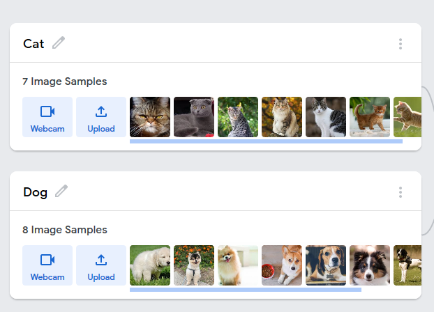

# Nets and Models: Model Formats and Runtimes

## Model Formats

* Bildmodell (Taggen von Bildern, Gesichtserkennung, Mimikerkennung)
* Sprachmodell (Diktieren eines Textes, Sprachsteuerung --> Alexa, Siri)
* Gestenmodell (Gestensteuerung)
* Analyse- und Prognose-Modell (Aktienkurs, Corona)


## Runtime
### Inferenzzeit

Inferenzzeit entspricht dem Intervall zwischen dem Input und dem Output eines Modells. Es ist also die Zeit, die für eine Entscheidungsfindung benötigt wird.

**Diese hängt von vielen verschiedenen Faktoren ab:**

Die Dauer wird zum einen von der Qualität des Inputs bestimmt. Dabei gilt: Je besser die Qualität, desto genauer kann das Ergebnis ermittelt werden (bei der Bildanalyse können z.B. Motive und ihre Details bei einer besseren Bildqualität viel besser von der KI erkannt werden). Dadurch wird jedoch auch der Prozess rechenintensiver, was zur Folge hat, dass mehr Zeit für die Berechnung des Outputs benötigt wird.

Auch die Größe des Inputs spielt eine entscheidende Rolle. Bei größerem Input müssen mehr Daten geladen und analysiert werden. Beispielsweise können bei der Musikanalyse kürzere Songs oder nur kleine Songpassagen schneller verarbeitet werden, was zu kürzeren Entscheidungsfindungszeiten führt.

Zudem ist die Zeitspanne von der Genauigkeit der Vorhersage abhängig.

Des Weiteren wird die Inferenzzeit auch von der Größe des gesamten Modells stark beeinflusst. Mit steigender Anzahl der Parameter, die für die Entscheidungsfindung notwendig sind, wird die Inferenzzeit größer. Wenn auf einem Foto z.B. nur erkannt werden soll, ob es sich um eine geometrische Form oder um ein Hund handelt, muss die KI weniger Parameter vergleichen (was sich natürlich positiv auf die Performance beeinflusst), als wenn ein Hund von einer Katze und noch weiteren Tieren unterschieden werden muss.

Hinzu kommt die Methode des Maschinellen Lernens. Manche Methoden sind für eine bestimmte Aufgabe deutlich besser geeignet als andere.

### Lebenszyklus

Mit dem Begriff Lebenszyklus wird die Zeitspanne bezeichnet, wie lange ein Modell im Betrieb ist und dabei jedoch nicht neu auf aktuelle Bedingungen trainiert wird.
```
Beispielshalber trainiert ein Unternehmen eine KI (zu Zeitpunkt T0). Das entstandene Modell analysiert vergangene Käufe von Kunden und sagt deren zukünftiges Kaufverhalten voraus. Anhand dessen kann das Unternehmen ihr Sortiment anpassen und auf diese Weise die Kundenzufriedenheit und den Umsatz erhöhen. Dabei ist es im Laufe der Zeit möglich, dass die Parameter zu spezifisch an alte Kundendaten angepasst sein können, da Kunden kündigen und neue Kunden dazugewonnen werden. Deshalb müssen gegebenenfalls veraltete Input-Trainingsdaten aktualisiert werden, indem das Modell (zu Zeitpunkt T1) mit neuen Kundeninformationen trainiert wird.
```
Die Zeitspanne von T0 bis T1 entspricht dabei dem Lebenszyklus.

## Teachable Machine
Die Teachable Machine ist ein sich immer weiter entwickelndes KI-Angebot von Google. Bisher können mit dem Webbrowser-Programm Bild-, Sprach- und Gestenerkennungsmodelle auf einfache Weise ohne Code erstellt und anschließend exportiert bzw. wieder neu eingebaut werden. Das Programm basiert auf Tensorflow, welches eine Open Source Machine Learning Bibliothek von dem besagten US-amerikanischen Technologieunternehmen darstellt. Dahinter steckt ein komplexes vortrainiertes neuronales Netz.

Die folgenden Bilder sind Screenshots von der sich im Einsatz befindlichen Teachable Machine, wobei ein Modell durch Katzen- und Hundefotos trainiert wurde, welches diese beiden Tierfamilien unterscheiden kann:




## Quellen
* [Allgemeine Quelle](https://course.elementsofai.com/de/)
* [Model Formats](https://de.wikipedia.org/wiki/K%C3%BCnstliche_Intelligenz#Anwendungen)
* [Lebenszyklus](https://www.industry-of-things.de/amp/analytics--der-lebenszyklus-von-modellen-a-714816/)
* [Teachable Machine](https://teachablemachine.withgoogle.com/)

## Gruppenmitglieder

* **Dennis Herzog**
* **Maxim Bickel**
* **Philipp Dobler** - *Projektleiter*
